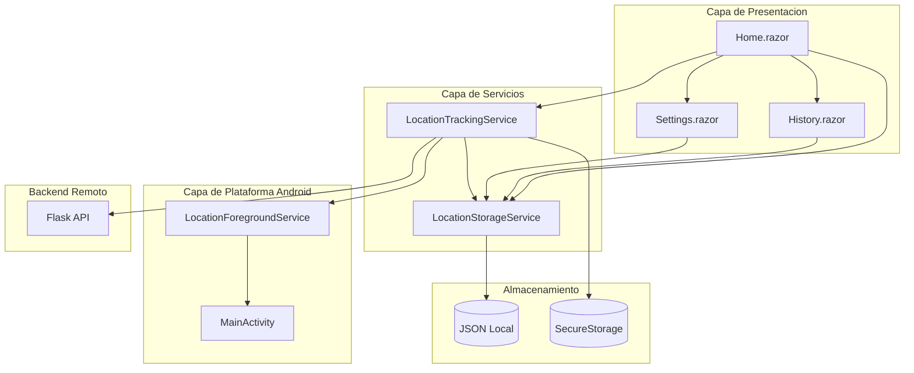
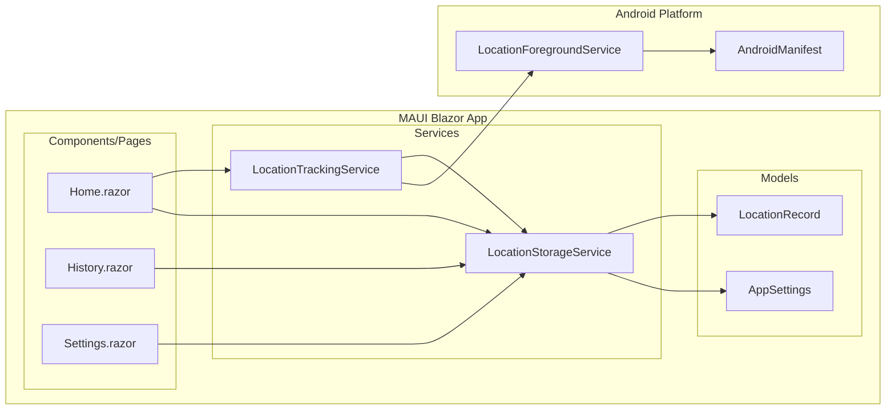
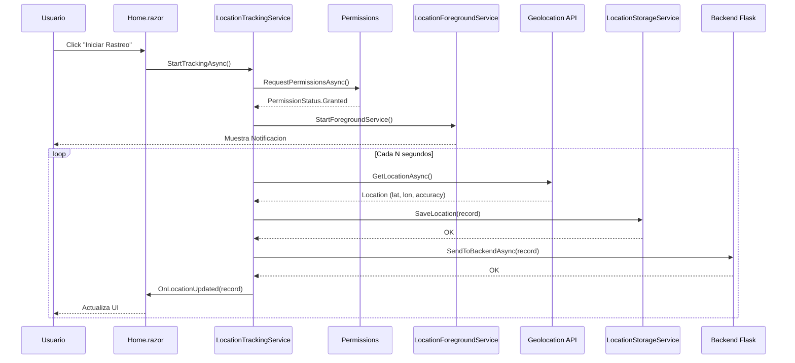
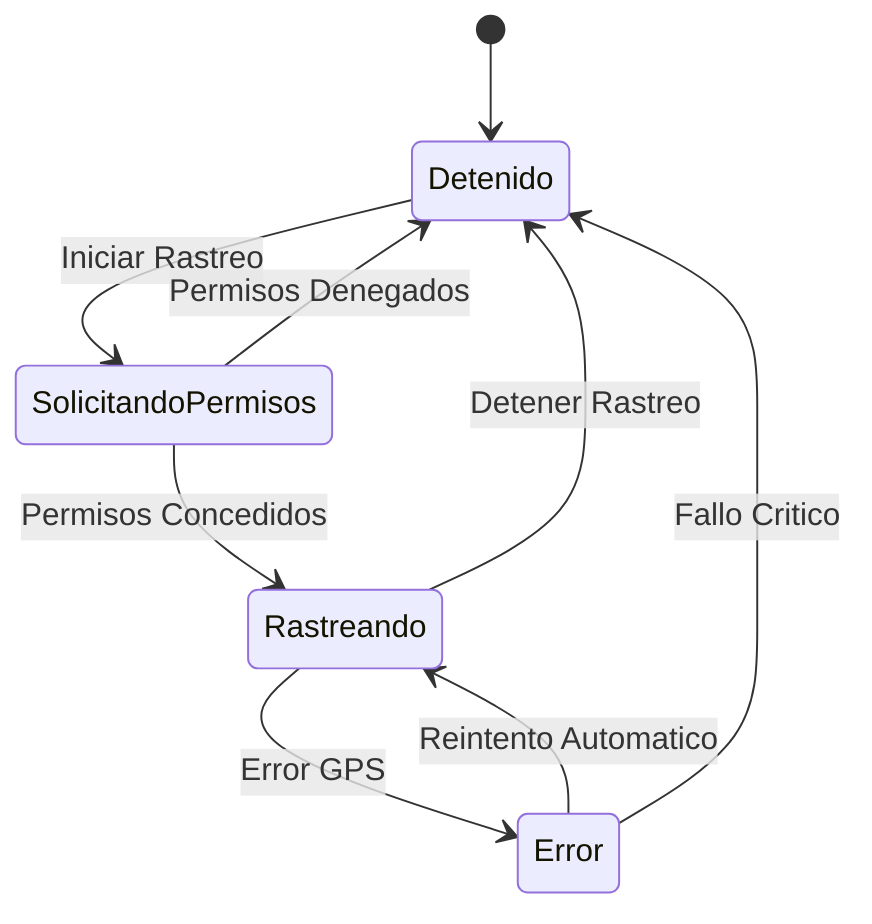
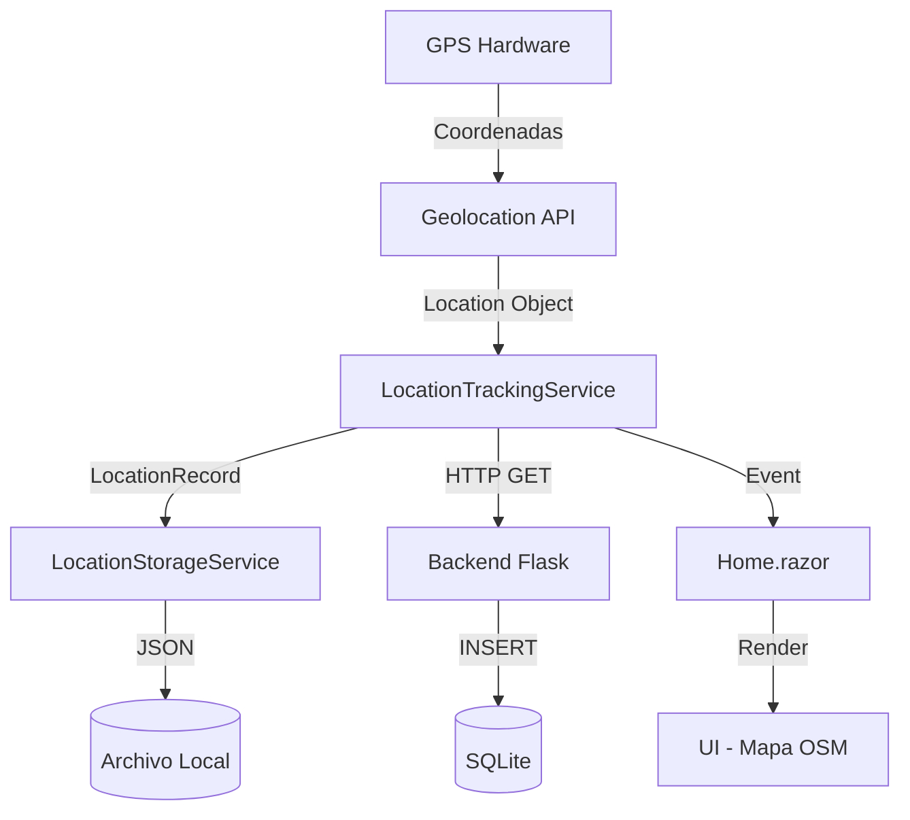
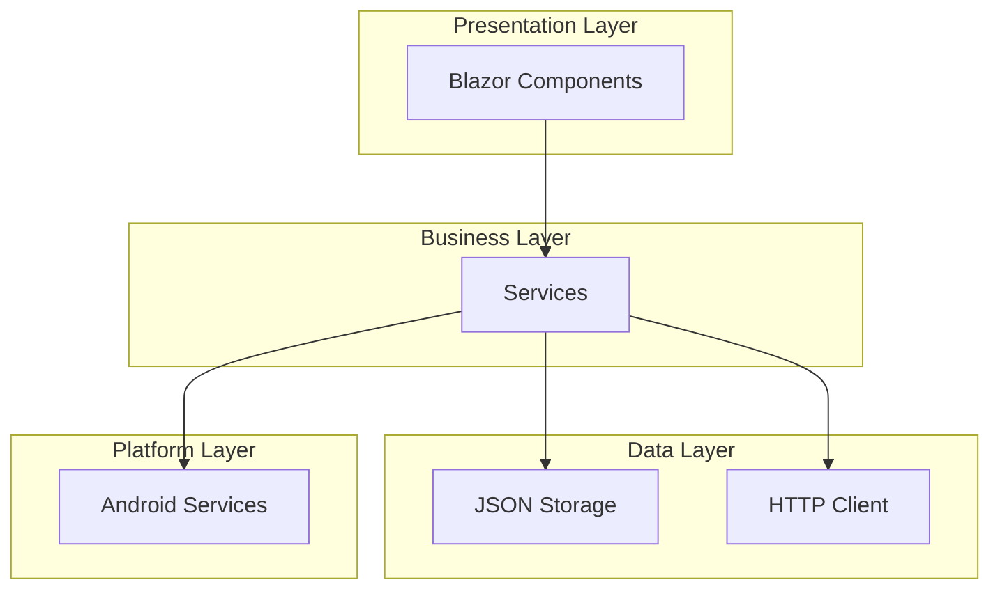
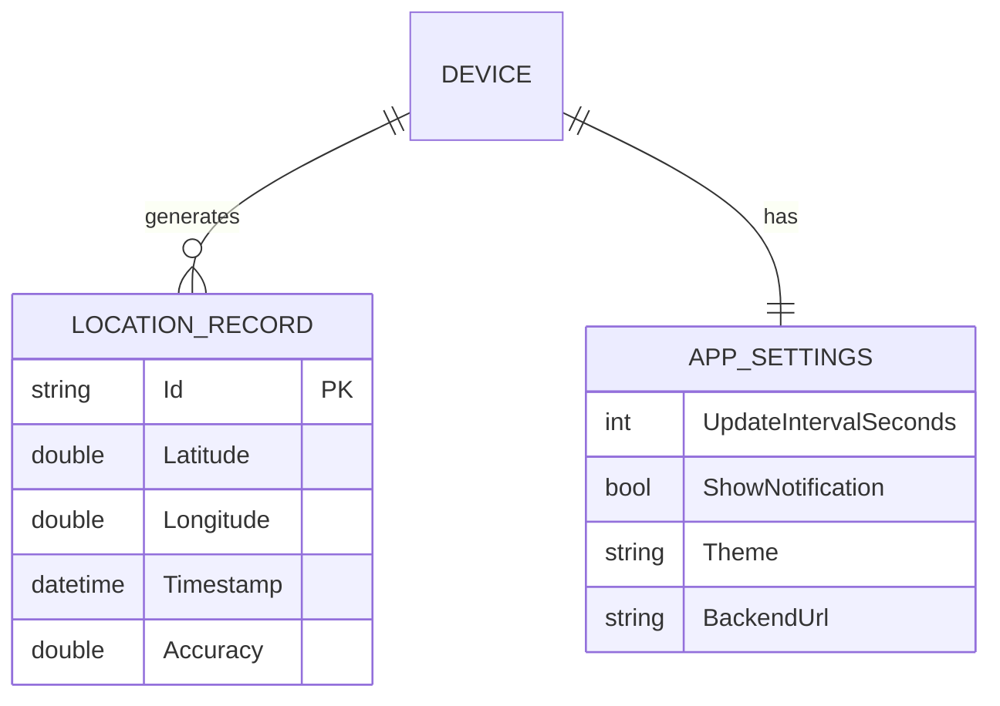

# GPS Tracker - Aplicacion Movil Android

Aplicacion movil nativa en Android desarrollada con .NET MAUI Blazor Hybrid que rastrea y muestra la ubicacion del usuario en tiempo real, actualizando las coordenadas en un mapa incluso cuando la aplicacion esta en segundo plano.

## Tabla de Contenidos

- [Caracteristicas](#caracteristicas)
- [Arquitectura](#arquitectura)
- [Requisitos del Sistema](#requisitos-del-sistema)
- [Instalacion](#instalacion)
- [Estructura del Proyecto](#estructura-del-proyecto)
- [Configuracion](#configuracion)
- [Uso](#uso)
- [API de Servicios](#api-de-servicios)
- [Diagramas](#diagramas)

## Caracteristicas

### Rastreo de Ubicacion
- Obtencion de coordenadas GPS (latitud, longitud) del dispositivo
- Actualizacion automatica con intervalos configurables:
  - 10 segundos
  - 60 segundos
  - 5 minutos
- Funcionamiento en segundo plano mediante Android Foreground Service
- Notificacion persistente configurable (ON/OFF)

### Visualizacion en Mapa
- Integracion con OpenStreetMap
- Marcador de posicion actual del usuario
- Actualizacion del mapa en tiempo real

### Almacenamiento de Historial
- Almacenamiento local en archivo JSON
- Cada registro incluye: latitud, longitud, timestamp y precision
- Sincronizacion con backend remoto (SQLite)

### Interfaz de Usuario
- Pantalla principal con mapa y coordenadas GPS
- Selector de intervalo de actualizacion
- Botones para iniciar/detener rastreo
- Pantalla de historial con lista de ubicaciones
- Temas personalizables:
  - **Tema Guinda** (IPN)
  - **Tema Azul** (ESCOM)
- Soporte para modo claro/oscuro del sistema

### Funcionalidades Adicionales
- Precision de ubicacion visible
- Opcion para limpiar historial
- Indicador visual del estado del rastreo
- Manejo de permisos en tiempo de ejecucion
- Configuracion de IP del backend

## Arquitectura



## Diagrama de Componentes



## Diagrama de Secuencia - Inicio de Rastreo



## Diagrama de Estados del Rastreo



## Requisitos del Sistema

### Desarrollo
- .NET 9.0 SDK
- Visual Studio 2022 / VS Code con extension C#
- Android SDK (API 24+)
- JDK 11 o superior

### Dispositivo
- Android 7.0 (API 24) o superior
- GPS habilitado
- Conexion a Internet (para sincronizacion con backend)

### Dependencias NuGet
```xml
<PackageReference Include="Microsoft.Maui.Controls" Version="$(MauiVersion)" />
<PackageReference Include="Microsoft.AspNetCore.Components.WebView.Maui" Version="$(MauiVersion)" />
<PackageReference Include="Microsoft.Extensions.Logging.Debug" Version="9.0.0" />
```

## Instalacion

### 1. Clonar el repositorio
```bash
git clone <repository-url>
cd Examen
```

### 2. Restaurar dependencias
```bash
dotnet restore
```

### 3. Compilar el proyecto
```bash
dotnet build
```

### 4. Ejecutar en emulador/dispositivo
```bash
# Para emulador Android
dotnet build -t:Run -f net9.0-android

# Para dispositivo fisico conectado
dotnet build -t:Run -f net9.0-android -p:AndroidAttachDebugger=true
```

## Estructura del Proyecto

```
Examen/
├── Components/
│   ├── Layout/
│   │   ├── MainLayout.razor        # Layout principal
│   │   └── MainLayout.razor.css    # Estilos del layout
│   ├── Pages/
│   │   ├── Home.razor              # Pantalla principal con mapa
│   │   ├── History.razor           # Historial de ubicaciones
│   │   └── Settings.razor          # Configuracion
│   ├── Routes.razor                # Configuracion de rutas
│   └── _Imports.razor              # Imports globales
├── Models/
│   ├── LocationRecord.cs           # Modelo de registro de ubicacion
│   └── AppSettings.cs              # Modelo de configuracion
├── Services/
│   ├── LocationTrackingService.cs  # Servicio de rastreo GPS
│   └── LocationStorageService.cs   # Servicio de almacenamiento
├── Platforms/
│   └── Android/
│       ├── AndroidManifest.xml     # Permisos y configuracion
│       ├── MainActivity.cs         # Activity principal
│       ├── MainApplication.cs      # Aplicacion Android
│       └── LocationForegroundService.cs # Servicio en segundo plano
├── Resources/
│   ├── AppIcon/                    # Iconos de la aplicacion
│   ├── Fonts/                      # Fuentes
│   ├── Images/                     # Imagenes
│   └── Splash/                     # Pantalla de inicio
├── wwwroot/
│   ├── css/
│   │   └── app.css                 # Estilos globales
│   └── index.html                  # HTML host para Blazor
├── App.xaml                        # Definicion de aplicacion
├── App.xaml.cs                     # Codigo de aplicacion
├── MainPage.xaml                   # Pagina principal XAML
├── MainPage.xaml.cs                # Codigo de pagina principal
├── MauiProgram.cs                  # Configuracion MAUI y DI
└── Examen.csproj                   # Archivo de proyecto
```

## Configuracion

### Permisos Android (AndroidManifest.xml)
```xml
<uses-permission android:name="android.permission.ACCESS_FINE_LOCATION" />
<uses-permission android:name="android.permission.ACCESS_COARSE_LOCATION" />
<uses-permission android:name="android.permission.ACCESS_BACKGROUND_LOCATION" />
<uses-permission android:name="android.permission.FOREGROUND_SERVICE" />
<uses-permission android:name="android.permission.FOREGROUND_SERVICE_LOCATION" />
<uses-permission android:name="android.permission.POST_NOTIFICATIONS" />
<uses-permission android:name="android.permission.INTERNET" />
```

### Configuracion del Backend
La URL del backend se puede configurar desde la pantalla de Settings:
- **Emulador Android:** `http://10.0.2.2:5000`
- **Dispositivo fisico:** `http://<IP_DEL_SERVIDOR>:5000`

## Uso

### Iniciar Rastreo
1. Abrir la aplicacion
2. Conceder permisos de ubicacion cuando se soliciten
3. Presionar "Iniciar Rastreo"
4. La aplicacion comenzara a registrar ubicaciones

### Configurar Intervalo
1. Seleccionar el intervalo deseado en el dropdown:
   - 10 segundos (mayor precision, mayor consumo de bateria)
   - 60 segundos (balance)
   - 5 minutos (menor consumo de bateria)

### Cambiar Tema
1. Ir a Configuracion o seleccionar en la pantalla principal
2. Elegir entre:
   - **Guinda (IPN):** Colores institucionales del IPN
   - **Azul (ESCOM):** Colores institucionales de ESCOM

### Ver Historial
1. Presionar "Historial"
2. Ver lista de ubicaciones registradas
3. Opcionalmente limpiar historial

## API de Servicios

### LocationTrackingService

```csharp
public class LocationTrackingService
{
    // Eventos
    event Action<LocationRecord>? OnLocationUpdated;
    event Action<bool>? OnTrackingStateChanged;
    event Action<string>? OnError;

    // Propiedades
    bool IsTracking { get; }
    LocationRecord? CurrentLocation { get; }

    // Metodos
    Task<bool> RequestPermissionsAsync();
    Task StartTrackingAsync();
    void StopTracking();
}
```

### LocationStorageService

```csharp
public class LocationStorageService
{
    void SaveLocation(LocationRecord record);
    List<LocationRecord> GetAllLocations();
    LocationRecord? GetLastLocation();
    void ClearHistory();
    AppSettings GetSettings();
    void UpdateSettings(AppSettings settings);
}
```

### LocationRecord

```csharp
public class LocationRecord
{
    string Id { get; set; }
    double Latitude { get; set; }
    double Longitude { get; set; }
    DateTime Timestamp { get; set; }
    double Accuracy { get; set; }
}
```

### AppSettings

```csharp
public class AppSettings
{
    int UpdateIntervalSeconds { get; set; }  // 10, 60, 300
    bool ShowNotification { get; set; }       // true/false
    string Theme { get; set; }                // "Guinda" o "Azul"
    string BackendUrl { get; set; }           // URL del servidor
}
```

## Diagramas

### Flujo de Datos



### Arquitectura de Capas



### Modelo de Datos



## Consideraciones Tecnicas

### Optimizacion de Bateria
- El intervalo de actualizacion afecta directamente el consumo de bateria
- Se recomienda usar intervalos mayores para uso prolongado
- El servicio en segundo plano mantiene el GPS activo

### Manejo de Errores
- GPS no disponible: Se muestra mensaje de error
- Permisos denegados: Se solicita nuevamente o se informa al usuario
- Sin conexion: Las ubicaciones se guardan localmente

### Compatibilidad
- Android 7.0 (API 24) minimo
- Probado en Android 12, 13 y 14
- Funciona en modo oscuro y claro del sistema

## Licencia

Este proyecto fue desarrollado como parte del Examen Final de la materia "Desarrollo de Aplicaciones Moviles Nativas" del Instituto Politecnico Nacional - ESCOM.

## Autor

Estudiante de Ingenieria en Sistemas Computacionales - Plan 2020
