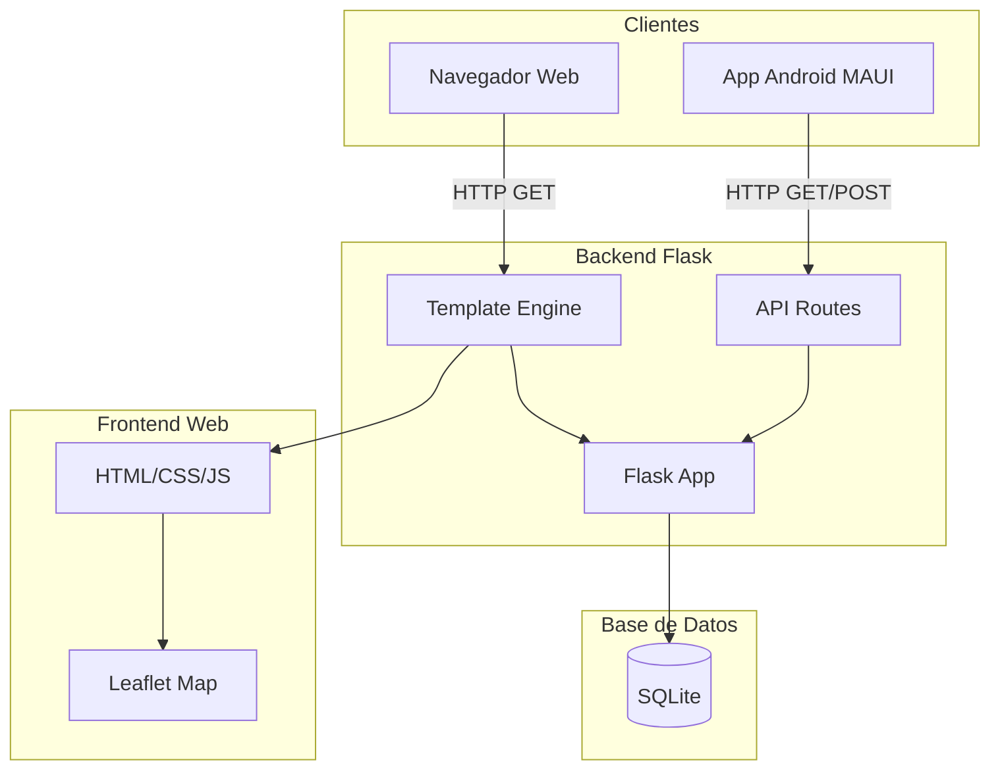
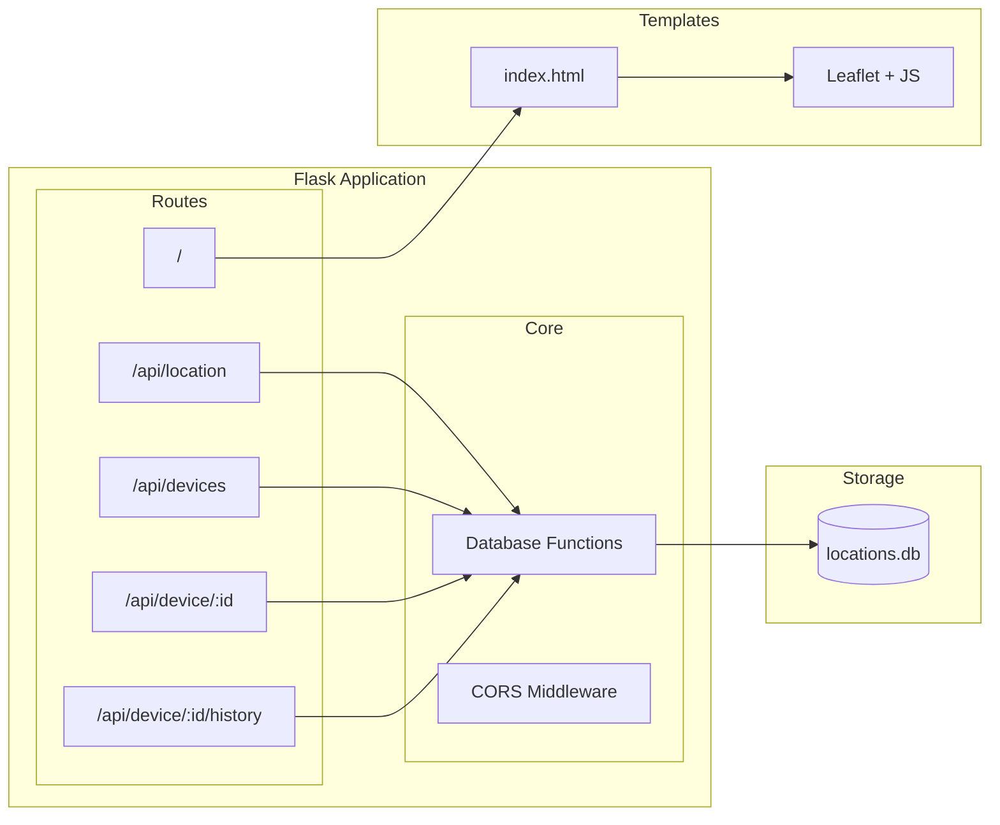
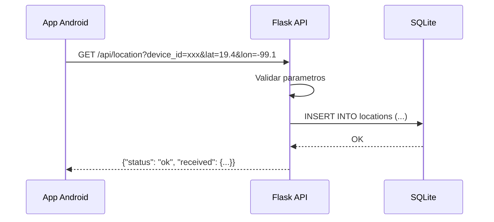
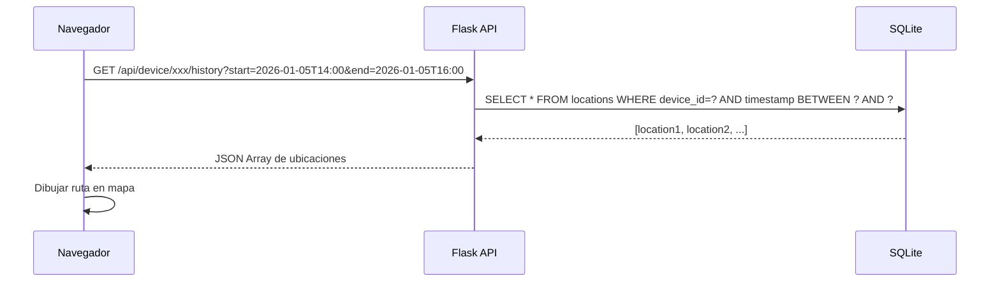
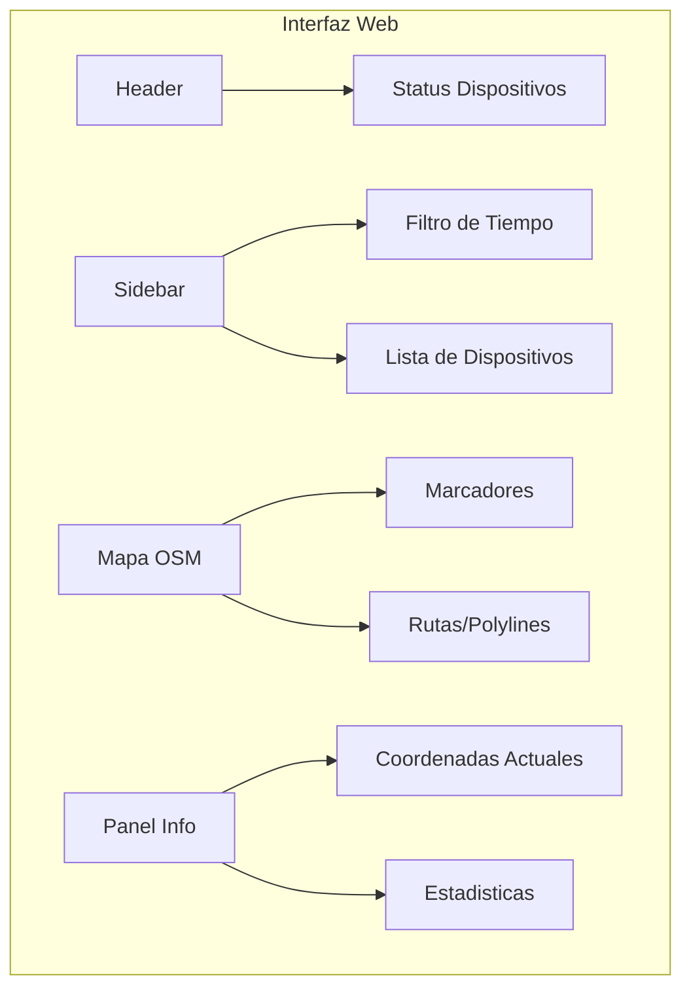
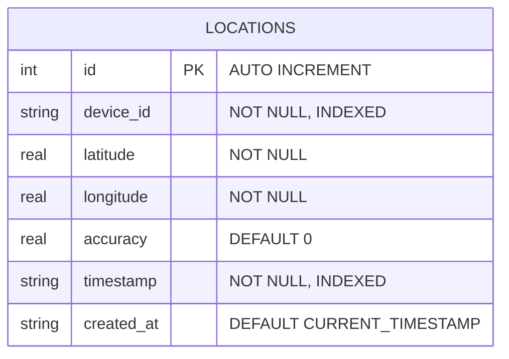
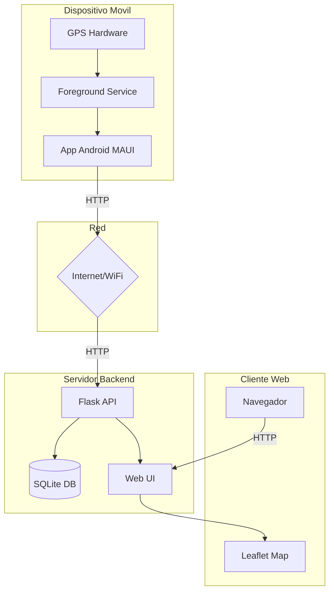
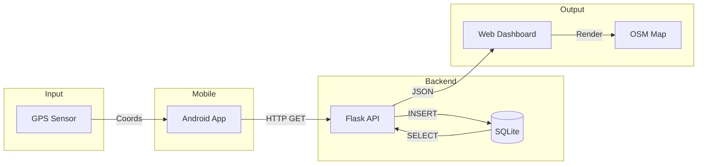
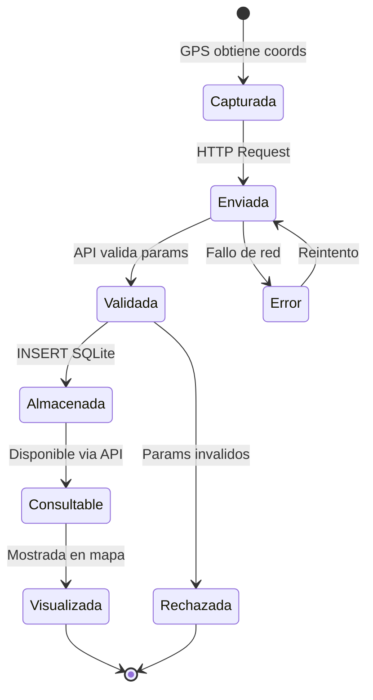
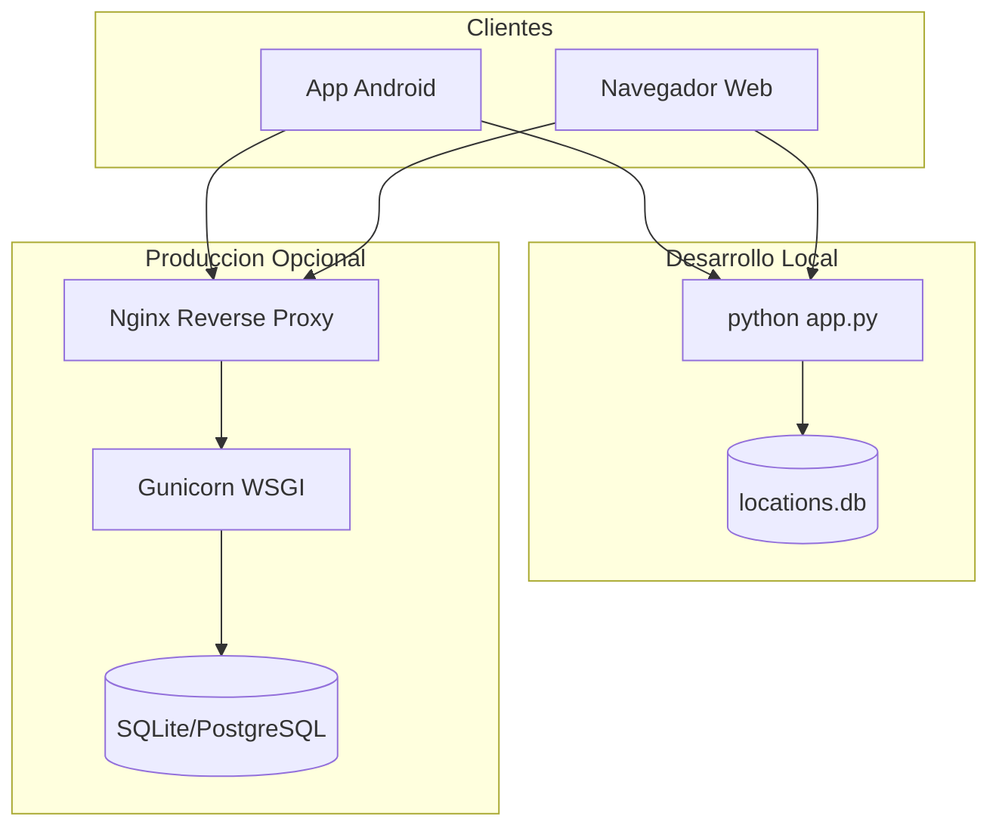

# GPS Tracker - Backend Flask

Backend REST API desarrollado en Flask para recibir, almacenar y visualizar ubicaciones GPS en tiempo real desde dispositivos moviles. Incluye interfaz web con mapa OpenStreetMap para monitoreo y filtrado de recorridos por rango de tiempo.

## Tabla de Contenidos

- [Caracteristicas](#caracteristicas)
- [Arquitectura](#arquitectura)
- [Requisitos del Sistema](#requisitos-del-sistema)
- [Instalacion](#instalacion)
- [Estructura del Proyecto](#estructura-del-proyecto)
- [API Reference](#api-reference)
- [Interfaz Web](#interfaz-web)
- [Base de Datos](#base-de-datos)
- [Diagramas](#diagramas)

## Caracteristicas

### API REST
- Recepcion de ubicaciones via GET y POST
- Almacenamiento persistente en SQLite
- Consulta de historial con filtros de tiempo
- Estadisticas por dispositivo
- Eliminacion de datos por dispositivo

### Interfaz Web
- Mapa interactivo con Leaflet/OpenStreetMap
- Visualizacion de dispositivos en tiempo real
- Filtro por rango de fechas
- Dibujo de rutas/recorridos
- Marcadores de inicio y posicion actual
- Actualizacion automatica cada 5 segundos

### Almacenamiento
- Base de datos SQLite
- Indices optimizados para consultas por dispositivo y tiempo
- Historial completo de ubicaciones

## Arquitectura



## Diagrama de Componentes



## Diagrama de Secuencia - Recepcion de Ubicacion



## Diagrama de Secuencia - Consulta con Filtro de Tiempo



## Requisitos del Sistema

### Python
- Python 3.8 o superior

### Dependencias
```
flask
flask-cors
```

### Hardware Recomendado
- 512 MB RAM minimo
- 100 MB espacio en disco

## Instalacion

### 1. Clonar/Navegar al directorio
```bash
cd ExamenBE
```

### 2. Crear entorno virtual (opcional pero recomendado)
```bash
python -m venv venv
source venv/bin/activate  # Linux/Mac
venv\Scripts\activate     # Windows
```

### 3. Instalar dependencias
```bash
pip install -r requirements.txt
```

### 4. Ejecutar el servidor
```bash
python app.py
```

El servidor iniciara en `http://0.0.0.0:5000`

### 5. Acceder a la interfaz web
Abrir navegador en `http://localhost:5000`

## Estructura del Proyecto

```
ExamenBE/
├── app.py              # Aplicacion Flask principal
├── requirements.txt    # Dependencias Python
├── locations.db        # Base de datos SQLite (generada automaticamente)
├── templates/
│   └── index.html      # Interfaz web con mapa
└── README.md           # Este archivo
```

## API Reference

### Endpoints

#### POST/GET `/api/location`
Recibe y almacena una ubicacion.

**Parametros (Query o JSON):**
| Parametro | Tipo | Requerido | Descripcion |
|-----------|------|-----------|-------------|
| device_id | string | Si | Identificador unico del dispositivo |
| lat | float | Si | Latitud |
| lon | float | Si | Longitud |
| accuracy | float | No | Precision en metros |
| timestamp | string | No | Fecha/hora ISO 8601 |

**Ejemplo Request:**
```bash
curl "http://localhost:5000/api/location?device_id=abc123&lat=19.4326&lon=-99.1332&accuracy=10"
```

**Response:**
```json
{
    "status": "ok",
    "received": {
        "device_id": "abc123",
        "lat": 19.4326,
        "lon": -99.1332,
        "accuracy": 10,
        "timestamp": "2026-01-05T15:30:00"
    }
}
```

---

#### GET `/api/devices`
Lista todos los dispositivos con su ubicacion actual.

**Response:**
```json
[
    {
        "device_id": "abc123",
        "current": {
            "lat": 19.4326,
            "lon": -99.1332,
            "accuracy": 10,
            "timestamp": "2026-01-05T15:30:00"
        },
        "history_count": 150
    }
]
```

---

#### GET `/api/device/<device_id>`
Obtiene informacion completa de un dispositivo.

**Response:**
```json
{
    "current": {
        "lat": 19.4326,
        "lon": -99.1332,
        "accuracy": 10,
        "timestamp": "2026-01-05T15:30:00"
    },
    "history": [
        {"lat": 19.4320, "lon": -99.1330, "accuracy": 8, "timestamp": "..."},
        {"lat": 19.4326, "lon": -99.1332, "accuracy": 10, "timestamp": "..."}
    ]
}
```

---

#### GET `/api/device/<device_id>/history`
Obtiene historial con filtros opcionales de tiempo.

**Parametros Query:**
| Parametro | Tipo | Descripcion |
|-----------|------|-------------|
| start | string | Fecha/hora inicio (ISO 8601) |
| end | string | Fecha/hora fin (ISO 8601) |

**Ejemplo - Filtrar de 2pm a 4pm:**
```bash
curl "http://localhost:5000/api/device/abc123/history?start=2026-01-05T14:00:00&end=2026-01-05T16:00:00"
```

**Response:**
```json
[
    {"lat": 19.4320, "lon": -99.1330, "accuracy": 8, "timestamp": "2026-01-05T14:05:00"},
    {"lat": 19.4325, "lon": -99.1331, "accuracy": 10, "timestamp": "2026-01-05T14:15:00"},
    {"lat": 19.4326, "lon": -99.1332, "accuracy": 10, "timestamp": "2026-01-05T15:30:00"}
]
```

---

#### GET `/api/device/<device_id>/stats`
Obtiene estadisticas del dispositivo.

**Response:**
```json
{
    "total_records": 150,
    "first_record": "2026-01-05T10:00:00",
    "last_record": "2026-01-05T18:30:00",
    "avg_accuracy": 12.5
}
```

---

#### DELETE `/api/clear/<device_id>`
Elimina todos los registros de un dispositivo.

**Response:**
```json
{
    "status": "deleted",
    "records": 150
}
```

---

#### DELETE `/api/clear-all`
Elimina todos los registros de todos los dispositivos.

**Response:**
```json
{
    "status": "deleted",
    "records": 500
}
```

## Interfaz Web

### Caracteristicas de la UI



### Funcionalidades

1. **Lista de Dispositivos**
   - Muestra todos los dispositivos conectados
   - Coordenadas actuales
   - Contador de registros
   - Click para seleccionar y ver en mapa

2. **Filtro por Tiempo**
   - Selector de fecha/hora inicio
   - Selector de fecha/hora fin
   - Boton "Aplicar" para filtrar
   - Boton "Todo" para ver historial completo
   - Boton "Limpiar" para resetear filtros

3. **Mapa Interactivo**
   - Tiles de OpenStreetMap
   - Zoom y pan
   - Marcador rojo: posicion actual
   - Marcador verde: punto de inicio
   - Linea guinda: ruta del recorrido

4. **Panel de Informacion**
   - Latitud y longitud actuales
   - Precision del GPS
   - Ultima actualizacion
   - Total de registros
   - Toggle para mostrar/ocultar ruta

## Base de Datos

### Esquema



### Indices
- `idx_device_id`: Optimiza consultas por dispositivo
- `idx_timestamp`: Optimiza filtros por tiempo

### Consultas SQL Principales

**Insertar ubicacion:**
```sql
INSERT INTO locations (device_id, latitude, longitude, accuracy, timestamp)
VALUES (?, ?, ?, ?, ?)
```

**Obtener historial con filtro:**
```sql
SELECT latitude, longitude, accuracy, timestamp
FROM locations
WHERE device_id = ?
  AND timestamp >= ?
  AND timestamp <= ?
ORDER BY timestamp ASC
```

**Estadisticas por dispositivo:**
```sql
SELECT
    COUNT(*) as total_records,
    MIN(timestamp) as first_record,
    MAX(timestamp) as last_record,
    AVG(accuracy) as avg_accuracy
FROM locations
WHERE device_id = ?
```

## Diagramas

### Arquitectura General del Sistema



### Flujo de Datos Completo



### Ciclo de Vida de una Ubicacion



### Modelo de Despliegue



## Configuracion Avanzada

### Variables de Entorno (Opcional)
```bash
export FLASK_ENV=development  # o production
export FLASK_DEBUG=1          # 0 en produccion
export DATABASE_PATH=./data/locations.db
```

### Despliegue con Gunicorn
```bash
pip install gunicorn
gunicorn -w 4 -b 0.0.0.0:5000 app:app
```

### Docker (Opcional)
```dockerfile
FROM python:3.11-slim
WORKDIR /app
COPY requirements.txt .
RUN pip install -r requirements.txt
COPY . .
EXPOSE 5000
CMD ["python", "app.py"]
```

## Consideraciones de Seguridad

- En produccion, usar HTTPS
- Implementar autenticacion para endpoints sensibles
- Validar y sanitizar todos los inputs
- Limitar tasa de requests (rate limiting)
- Backup regular de la base de datos

## Troubleshooting

### Error: "Address already in use"
```bash
# Encontrar proceso usando puerto 5000
lsof -i :5000
# Matar proceso
kill -9 <PID>
```

### Error: "CORS blocked"
Verificar que flask-cors este instalado y configurado:
```python
from flask_cors import CORS
CORS(app)
```

### Base de datos corrupta
```bash
# Eliminar y reiniciar
rm locations.db
python app.py  # Se recreara automaticamente
```

## Licencia

Este proyecto fue desarrollado como parte del Examen Final de la materia "Desarrollo de Aplicaciones Moviles Nativas" del Instituto Politecnico Nacional - ESCOM.

## Autor

Estudiante de Ingenieria en Sistemas Computacionales - Plan 2020
